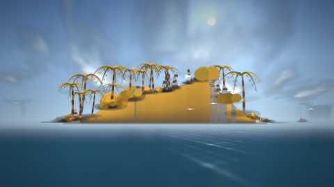
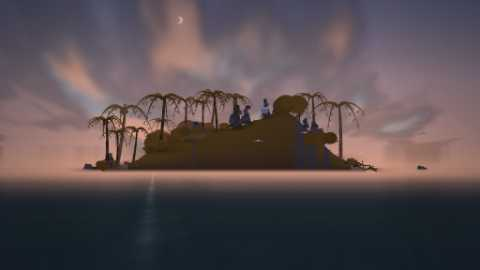
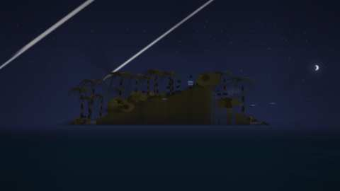
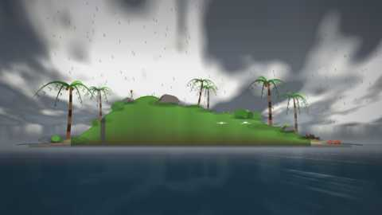

# Auditoria do Driftwood

Levantamento feito em **29/07/2026** sobre o código em `C:\Nova pasta\driftwood`,
sem nenhuma alteração no projeto. Os únicos arquivos criados foram este documento
e as três imagens em `docs/auditoria/`.

Método: inspeção estática dos arquivos (busca por padrão), execução real no
navegador com o servidor de desenvolvimento (`npm run dev`, porta 5273) e medição
pela ponte de depuração `window.__driftwood` que já existe em `src/main.ts`.

Toda afirmação abaixo é acompanhada da forma de verificá-la. **A seção 12 lista
oito defeitos reais encontrados durante esta auditoria**, um deles grave: o
sistema de partículas não emitia nada.

> **Atualização, mesmo dia, após a auditoria:** a pedido, os defeitos **D1, D2,
> D7 e D8 foram corrigidos** e o **D3 foi parcialmente destravado** (o binário do
> Electron agora existe e a casca de desktop rodou pela primeira vez). As seções
> mantêm o achado original — é o registro do que a auditoria encontrou — e cada
> uma traz um bloco *Correção aplicada* com a mudança e a nova medição.

---

## 1. Estrutura de pastas

```
driftwood/
├── AUDITORIA.md                (este documento)
├── README.md
├── index.html
├── package.json
├── package-lock.json
├── tsconfig.json
├── vite.config.ts
├── .gitignore
├── docs/
│   ├── ARQUITETURA.md
│   └── auditoria/
│       ├── 01-dia-outono.jpg
│       ├── 02-por-do-sol.jpg
│       └── 03-noite-meteoros.jpg
├── electron/
│   ├── main.cjs
│   └── preload.cjs
└── src/
    ├── main.ts
    ├── ai/
    │   ├── actions.ts
    │   ├── brain.ts
    │   ├── context.ts
    │   ├── needs.ts
    │   └── skills.ts
    ├── audio/
    │   └── ambience.ts
    ├── core/
    │   ├── config.ts
    │   ├── ecs.ts
    │   ├── events.ts
    │   ├── math.ts
    │   └── rng.ts
    ├── persist/
    │   └── save.ts
    ├── render/
    │   ├── backdrop.ts
    │   ├── brushes.ts
    │   ├── camera.ts
    │   ├── character.ts
    │   ├── creatures.ts
    │   ├── gl.ts
    │   ├── painter.ts
    │   ├── palette.ts
    │   ├── particles.ts
    │   └── renderer.ts
    ├── sim/
    │   ├── calendar.ts
    │   ├── components.ts
    │   ├── context.ts
    │   ├── genesis.ts
    │   ├── island.ts
    │   ├── queries.ts
    │   ├── systems.ts
    │   ├── tides.ts
    │   ├── weather.ts
    │   └── worldState.ts
    └── story/
        ├── director.ts
        ├── rareEvents.ts
        ├── stories.ts
        └── types.ts
```

`node_modules/` e `dist/` existem mas são gerados e estão no `.gitignore`.
O projeto **não** é um repositório git (`git status` → `fatal: not a git repository`).

**Não há um único arquivo de imagem, áudio ou fonte em `src/`.** As três imagens
em `docs/auditoria/` foram produzidas agora, como prova, e não são carregadas pelo
programa.

---

## 2. Linhas por arquivo

Contagem via `Get-Content | Measure-Object -Line`.

### `src/` — 37 arquivos, 6.876 linhas

| Arquivo | Linhas | Bytes |
| --- | ---: | ---: |
| `src/ai/actions.ts` | 601 | 21.992 |
| `src/ai/brain.ts` | 167 | 6.728 |
| `src/ai/context.ts` | 20 | 630 |
| `src/ai/needs.ts` | 75 | 3.497 |
| `src/ai/skills.ts` | 41 | 1.666 |
| `src/audio/ambience.ts` | 181 | 7.655 |
| `src/core/config.ts` | 54 | 2.095 |
| `src/core/ecs.ts` | 289 | 9.764 |
| `src/core/events.ts` | 50 | 1.512 |
| `src/core/math.ts` | 74 | 3.102 |
| `src/core/rng.ts` | 102 | 3.132 |
| `src/main.ts` | 232 | 9.313 |
| `src/persist/save.ts` | 141 | 4.366 |
| `src/render/backdrop.ts` | 330 | 13.556 |
| `src/render/brushes.ts` | 487 | 23.385 |
| `src/render/camera.ts` | 72 | 2.533 |
| `src/render/character.ts` | 383 | 14.543 |
| `src/render/creatures.ts` | 280 | 15.380 |
| `src/render/gl.ts` | 89 | 3.240 |
| `src/render/painter.ts` | 227 | 8.315 |
| `src/render/palette.ts` | 139 | 6.047 |
| `src/render/particles.ts` | 189 | 7.181 |
| `src/render/renderer.ts` | 417 | 18.489 |
| `src/sim/calendar.ts` | 89 | 3.711 |
| `src/sim/components.ts` | 161 | 5.781 |
| `src/sim/context.ts` | 9 | 360 |
| `src/sim/genesis.ts` | 81 | 4.186 |
| `src/sim/island.ts` | 182 | 7.471 |
| `src/sim/queries.ts` | 105 | 3.433 |
| `src/sim/systems.ts` | 284 | 12.433 |
| `src/sim/tides.ts` | 16 | 755 |
| `src/sim/weather.ts` | 173 | 7.430 |
| `src/sim/worldState.ts` | 91 | 3.136 |
| `src/story/director.ts` | 116 | 3.891 |
| `src/story/rareEvents.ts` | 290 | 10.141 |
| `src/story/stories.ts` | 596 | 22.230 |
| `src/story/types.ts` | 43 | 1.591 |

Subtotais por pasta: `ai` 904 · `audio` 181 · `core` 569 · `main.ts` 232 ·
`persist` 141 · `render` 2.613 · `sim` 1.191 · `story` 1.045.

### Fora de `src/`

| Arquivo | Linhas | Bytes |
| --- | ---: | ---: |
| `electron/main.cjs` | 122 | 4.415 |
| `electron/preload.cjs` | 13 | 616 |
| `README.md` | 154 | 8.403 |
| `docs/ARQUITETURA.md` | 120 | 7.903 |
| `index.html` | 50 | 1.947 |
| `package.json` | 24 | 674 |
| `tsconfig.json` | 21 | 573 |
| `vite.config.ts` | 11 | 274 |
| `.gitignore` | 6 | 57 |
| `package-lock.json` | 1.898 | 62.242 |

---

## 3. Papel de cada arquivo

### `core/` — infraestrutura sem dependências

| Arquivo | Papel |
| --- | --- |
| `ecs.ts` | ECS completo: `defineComponent`, `World` (sparse-set com vetor esparso `Int32Array`, remoção troca-com-último, destruição adiada + `flush`), `query`/`first`, serialização/desserialização por componente, `enum Stage` com 8 estágios, `Scheduler` com ordenação por estágio, `every: N` e coleta opcional de custo. |
| `rng.ts` | `Rng` (mulberry32) com `range`/`int`/`chance`/`pick`/`weighted`/`gauss`/`fork`, estado exposto para o save; `hash2`, `noise1`, `fbm1`, `hashString`. |
| `math.ts` | `clamp`/`lerp`/`smoothstep`/`approach`, tipo `RGB` e mistura de cor em espaço gamma-2, `desaturate`, `hsl`, curvas de *easing*, `osc`. |
| `events.ts` | `EventBus` com fila por passo, `on`/`onAny`/`emit`/`dispatch`. Eventos publicados durante a entrega vão para o passo seguinte. |
| `config.ts` | Constantes de sintonia: `SIM` (passo 1/20 s, 2 min de mundo por segundo real, 12 dias por estação, ciclo lunar 29,5), `WORLD`, `RENDER`, `PERSIST`, três perfis em `QUALITY`. |

### `sim/` — o mundo

| Arquivo | Papel |
| --- | --- |
| `components.ts` | Os 12 componentes (seção 5). |
| `island.ts` | Classe `Island`: campo de altura de 1.024 amostras derivado da semente, relevo assimétrico, feições (caverna, nascente, cume, rochedos, enseada, coqueiral), `groundAt`/`slopeAt`/`surfaceAt`/`isBeach`/`clampToLand`, erosão acumulada (`erode`/`settle`) serializável. |
| `calendar.ts` | Minutos de mundo → `SkyTime`: dia, hora, estação, inclinação sazonal, altitude/azimute do sol e da lua, fase lunar, `daylight`, `goldenHour`; `temperature`, `formatClock`, `moonName`. |
| `weather.ts` | Máquina de 8 climas com matriz de transição por estação, valores suavizados (nuvem, chuva, vento, névoa), raios, 4 fenômenos de céu com condições físicas, `severity`, `describe`. |
| `tides.ts` | `tideAt` (semidiurna com modulação lunar) e `swell`. |
| `worldState.ts` | Recurso global: calendário, clima, ilha, céu derivado, maré, bandeiras, estatísticas, recargas de história, crônica e **cinco fluxos de RNG separados**. |
| `context.ts` | Tipo `DriftContext` (world + ws + bus + dt) passado a todo sistema. |
| `queries.ts` | Consultas reutilizáveis: `findProp`, `currentProject`, `mostDamagedProp`, `nearestFruitingPalm`, `findCritter`, `countPlants`, `spawnProp`. |
| `genesis.ts` | Estado inicial: palmeiras, arbustos, rochedos, caranguejos, gaivotas, os destroços do naufrágio e o náufrago. |
| `systems.ts` | 9 dos 11 sistemas (seção 4). |

### `ai/` — o náufrago

| Arquivo | Papel |
| --- | --- |
| `needs.ts` | Taxas de subida por segundo de mundo, medo reativo ao clima, linha de base de felicidade, curvas `urgency`/`desire`, `dominantNeed`. |
| `actions.ts` | Catálogo com as 27 ações (seção 6) e os utilitários `say`, `mishap`, `reward`. |
| `brain.ts` | `mindSystem` (deriva necessidades, pontua, aplica ruído/recarga/penalidade de repetição, interrupção por urgência) e `actSystem` (caminhada em tempo real, execução em tempo de mundo); `currentPose`. |
| `skills.ts` | 10 habilidades, ganho com retorno decrescente, marcos, títulos. |
| `context.ts` | Tipo `AIContext`. |

### `story/` — narrativa

| Arquivo | Papel |
| --- | --- |
| `types.ts` | Tipos `Story`, `StoryStep`, `StoryCtx`. |
| `stories.ts` | 29 histórias: molde `projectStory` + 17 obras + 12 arcos escritos à mão. |
| `rareEvents.ts` | 17 eventos raros com frequência por dia de mundo e condições duras; `rollRareEvents`. |
| `director.ts` | Sistema que sorteia uma história por vez, avança passos (`wait`/`until`/`timeout`) e chama os eventos raros. |

### `render/` — imagem

| Arquivo | Papel |
| --- | --- |
| `gl.ts` | Criação de contexto WebGL2, compilação/link de programas com introspecção de uniformes e atributos, quad de tela cheia, vértice compartilhado. |
| `backdrop.ts` | Programa de céu e oceano (seção 9). |
| `painter.ts` | Pincel 2D em lote: 120.000 vértices, 6 floats por vértice, um `drawArrays` por descarga; `tri`, `triShaded`, `quad`, `poly`, `strip`, `stripShaded`, `circle`, `ellipse`, `line`, `taper`, `capsule`, `curve`, `softShadow`. |
| `palette.ts` | `computeLighting` (cores de céu por hora e clima, luz principal sol/lua, ambiente, rebote, névoa, exposição), `lit`, `shadowColor`, `waterColor`, `foamColor`, `foliageColor` por estação e constantes de material. |
| `brushes.ts` | 27 chaves de pincel para vegetação e construções. |
| `creatures.ts` | 20 chaves de pincel para bichos e prodígios. |
| `character.ts` | Esqueleto articulado do náufrago: `poseRig` com 17 poses, desenho de pernas/torso/cabeça/cabelo/barba/olho/sorriso e 5 objetos de mão. |
| `particles.ts` | Pool de partículas em `Float32Array`/`Uint8Array` com buffer circular, 6 tipos, integração e desenho. **Ver defeito D1 na seção 12.** |
| `camera.ts` | Câmera contemplativa: enquadramento alvo, aproximação exponencial, respiração, tempo de permanência. |
| `renderer.ts` | Orquestra: redimensionamento com teto de pixels, escolha de plano, névoa de horizonte, terreno em faixas com gradiente, linha de espuma, coleta e ordenação de desenháveis, partículas, véu de clima, vinheta, rebaixamento de qualidade. |

### Restante

| Arquivo | Papel |
| --- | --- |
| `main.ts` | Bootstrap: carrega ou cria o mundo, registra os 11 sistemas, laço de passo fixo com teto de recuperação, crônica no DOM, teclas, autosave, ponte `window.__driftwood`. |
| `persist/save.ts` | Serialização versionada, backend duplo (`localStorage` no navegador, ponte do Electron no desktop), `applySave`, `wipeSave`. |
| `audio/ambience.ts` | Áudio sintetizado: três leitos de ruído filtrado, `tone`, `burst`, eventos ligados ao barramento, pássaros/insetos/crepitar. |
| `electron/main.cjs` | Casca de desktop, modos `/s` `/c` `/p` `--dev`, IPC de save atômico. **Não executado — ver D3.** |
| `electron/preload.cjs` | Ponte `contextBridge` com quatro funções. |
| `index.html` | Canvas, crônica, HUD, tela de abertura e todo o CSS. |

---

## 4. Sistemas ECS — 11

Todos implementam `System<DriftContext>` e são registrados em `src/main.ts:44-56`.
Ordem de execução dada pelo `enum Stage`, não pela ordem de registro.

| # | Nome | Estágio | `every` | Arquivo:linha | O que faz |
| --: | --- | --- | :-: | --- | --- |
| 1 | `tempo` | Time (0) | 1 | `sim/systems.ts:19` | Avança relógio, recalcula céu e maré, roda o clima, emite `novo-dia`, `nova-estação`, `clima`, `raio`, `fenômeno`. |
| 2 | `mente` | Mind (1) | 1 | `ai/brain.ts:92` | Deriva necessidades, pontua as 27 ações, escolhe, trata interrupção urgente. |
| 3 | `envelhecer` | Mind (1) | 20 | `sim/systems.ts:262` | Idade em dias, desgaste, barba, troca de roupa, marco de 30 dias. |
| 4 | `ação` | Act (2) | 1 | `ai/brain.ts:141` | Caminhada (tempo real) e execução da ação (tempo de mundo). |
| 5 | `bichos` | Act (2) | 1 | `sim/systems.ts:164` | Caranguejo, gaivota e papagaio (o papagaio acompanha quando `bond > 0.3`). |
| 6 | `física` | Physics (3) | 1 | `sim/systems.ts:59` | Gravidade, repouso de corpos parados, flutuação com balanço de onda. |
| 7 | `efêmeros` | Physics (3) | 1 | `sim/systems.ts:220` | Conta `ttl` de `Ephemeral` e de `RareMark`, destrói ao zerar. |
| 8 | `aparição` | Physics (3) | 1 | `sim/systems.ts:247` | Sobe `opacity` de 0 a 1 para nada surgir com estalo. |
| 9 | `ecologia` | Ecology (4) | 10 | `sim/systems.ts:106` | Crescimento e frutificação, dano de tempestade, erosão e assentamento da praia, desgaste e ruína de construções. |
| 10 | `fogo` | Ecology (4) | 20 | `sim/systems.ts:289` | Consome combustível da fogueira; chuva apaga. |
| 11 | `diretor` | Director (5) | 20 | `story/director.ts:63` | Sorteia e avança histórias, sorteia eventos raros. |

Os estágios `Audio (6)` e `Persist (7)` estão declarados no `enum` mas **nenhum
sistema os ocupa**: áudio e persistência são chamados diretamente do laço em
`main.ts`. Isso é uma divergência entre o desenho declarado e o uso real.

Verificação: `grep -n "System<DriftContext>" src/` devolve exatamente 11 ocorrências.

---

## 5. Componentes — 12

Definidos em `src/sim/components.ts` via `defineComponent`.

| # | Constante | Nome no save | Linha | Persistente | Campos |
| --: | --- | --- | --: | :-: | --- |
| 1 | `CTransform` | `Transform` | 13 | sim | `x, y, depth, facing, scale, rot` |
| 2 | `CBody` | `Body` | 30 | sim | `vx, vy, mass, drag, bounce, buoyant, grounded, asleep` |
| 3 | `CCastaway` | `Castaway` | 46 | sim | `name, ageDays, weathering, beard, outfit, mood` |
| 4 | `CNeeds` | `Needs` | 63 | sim | `hunger, thirst, rest, curiosity, fear, creativity, laziness, happiness, loneliness, hope` |
| 5 | `CBrain` | `Brain` | 85 | sim | `action, elapsed, duration, phase, targetX, targetEntity, lastRun, intent, frustration` |
| 6 | `CSkills` | `Skills` | 94 | sim | mapa nome → 0..1 |
| 7 | `CProp` | `Prop` | 110 | sim | `kind, progress, condition, builtOnDay, seed, flags` |
| 8 | `CPlant` | `Plant` | 126 | sim | `species, growth, health, maxHeight, seed, fruit, plantedOnDay` |
| 9 | `CCritter` | `Critter` | 140 | sim | `species, state, timer, bond, homeX, seed` |
| 10 | `CVisual` | `Visual` | 155 | sim | `brush, seed, opacity, shadow` |
| 11 | `CRare` | `RareMark` | 166 | sim | `event, ttl, phase` |
| 12 | `CEphemeral` | `Ephemeral` | 173 | **não** | `ttl, fade` |

Dois achados: `CEphemeral` nunca é adicionado por código algum e `CVisual.shadow`
nunca é lido. Ver D4 e D5 na seção 12.

---

## 6. Ações da IA — 27

Todas em `src/ai/actions.ts`, no vetor `ACTIONS`. Durações em segundos de mundo
(1 hora de mundo = 3.600). Nenhuma delas precisa de registro em outro lugar: o
`mindSystem` percorre o vetor inteiro a cada passo.

| # | `id` | Linha | Pose | Duração | Recarga | O que move a pontuação |
| --: | --- | --: | --- | --- | --- | --- |
| 1 | `beber` | 85 | agachado | 220–420 | — | sede × 1,25; vai até a nascente |
| 2 | `beber-da-chuva` | 98 | olhando-cima | 120–240 | 6 h | só com chuva |
| 3 | `comer-coco` | 109 | comendo | 300–620 | — | fome; exige palmeira com fruto |
| 4 | `pescar` | 131 | pescando | 1.600–4.200 | — | fome + habilidade; zero em tempestade |
| 5 | `cozinhar` | 161 | agachado | 900–1.800 | — | exige fogueira **e** peixe cru |
| 6 | `dormir` | 183 | deitado | 4–7 h | — | cansaço × noite, menos medo |
| 7 | `abrigar-se` | 204 | encolhido | 1.800–5.400 | — | medo × 5,5; **urgente** |
| 8 | `acender-fogueira` | 224 | agachado | 600–1.400 | 4 h | noite + solidão; exige fogueira apagada |
| 9 | `construir` | 257 | martelando | 2.200–5.200 | — | esperança + criatividade + progresso da obra |
| 10 | `consertar` | 294 | martelando | 1.400–3.000 | — | (1 − condição) × 2,2 |
| 11 | `coletar-lenha` | 314 | carregando | 1.200–2.600 | 5 h | estoque de lenha < 4 |
| 12 | `plantar` | 326 | agachado | 900–2.000 | 20 h | primavera/verão + esperança |
| 13 | `explorar` | 357 | andando | 1.800–4.200 | — | curiosidade × luz do dia; pode achar a caverna |
| 14 | `olhar-horizonte` | 383 | olhando | 900–2.400 | — | solidão + falta de esperança + hora dourada |
| 15 | `colecionar-conchas` | 397 | agachado | 1.200–2.800 | 8 h | curiosidade + preguiça |
| 16 | `esculpir` | 414 | esculpindo | 2.400–5.400 | 26 h | criatividade × 1,3 |
| 17 | `observar-estrelas` | 433 | deitado-olhando | 2.400–6.000 | — | só noite limpa; +2,2 durante meteoros |
| 18 | `nadar` | 455 | nadando | 1.400–3.200 | 10 h | calor + mar calmo |
| 19 | `castelo-de-areia` | 473 | agachado | 1.800–3.600 | 30 h | criatividade + preguiça |
| 20 | `jogar-pedra` | 489 | jogando | 500–1.200 | — | preguiça + 0,12 |
| 21 | `dançar-na-chuva` | 500 | dançando | 900–2.000 | 40 h | chuva sem tempestade × felicidade |
| 22 | `escrever-diário` | 512 | sentado | 1.400–3.000 | 20 h | exige a bandeira `tem-diário` |
| 23 | `usar-telescópio` | 525 | telescópio | 1.600–3.600 | — | exige o telescópio construído |
| 24 | `conversar-com-papagaio` | 541 | sentado | 1.200–2.800 | — | solidão × 1,4; exige o papagaio |
| 25 | `acenar-para-o-mar` | 568 | acenando | 600–1.400 | — | 6 se há algo no horizonte; **urgente** |
| 26 | `cochilar` | 585 | deitado | 1.800–4.000 | — | preguiça + cansaço + início da tarde |
| 27 | `ocioso` | 596 | parado | 400–1.400 | — | 0,08 fixo (rede de segurança) |

Exercitadas de fato numa corrida de 35 dias de mundo: **21 de 27**. As seis que
não rodaram e o porquê estão em D6.

---

## 7. Eventos raros — 17

Em `src/story/rareEvents.ts`. `perDay` é a chance esperada **por dia de mundo**
(1 dia ≈ 12 minutos reais). `rollRareEvents` dispara no máximo um por vez.

| # | `id` | Linha | `perDay` | Espera aproximada | Condição obrigatória |
| --: | --- | --: | --- | --- | --- |
| 1 | `navio` | 58 | 1/22 | ~4,4 h reais | dia claro, névoa < 0,4 |
| 2 | `baleia` | 93 | 1/55 | ~11 h | — |
| 3 | `navio-pirata` | 71 | 1/90 | ~18 h | escuro (luz < 0,35) |
| 4 | `baú-do-tesouro` | 168 | 1/120 | ~24 h | maré \|·\| > 1,2 |
| 5 | `submarino` | 83 | 1/140 | ~28 h | — |
| 6 | `ovni` | 103 | 1/260 | ~52 h | noite fechada (luz < 0,08) |
| 7 | `sereia` | 116 | 1/320 | ~64 h | lua cheia (fase 0,45–0,55) e noite |
| 8 | `exploradores` | 182 | 1/400 | ~80 h | dia claro (luz > 0,5) |
| 9 | `kraken` | 131 | 1/700 | ~140 h | tempestade ou furacão |
| 10 | `ilha-flutuante` | 154 | 1/800 | ~160 h | nuvem > 0,5 |
| 11 | `robô` | 221 | 1/900 | ~180 h | — |
| 12 | `chuva-de-peixes` | 261 | 1/1000 | ~200 h | vento > 0,8 |
| 13 | `vulcão` | 143 | 1/1100 | ~220 h | — |
| 14 | `astronauta` | 196 | 1/1400 | ~280 h | — |
| 15 | `castelo-vivo` | 250 | 1/1800 | ~360 h | noite (luz < 0,12) |
| 16 | `portal` | 209 | 1/2000 | ~400 h | durante uma aurora |
| 17 | `dragão` | 232 | 1/2600 | ~520 h | caverna já descoberta e escuro |

A coluna "espera aproximada" é a média se a condição estivesse sempre satisfeita;
como quase todas exigem hora, clima ou fase da lua específicos, a espera real é
maior. Medido: **2 eventos raros em 35 dias de mundo** (ambos `navio`).

> Correção: na conversa anterior eu disse "18 prodígios". São **17**.

---

## 8. Capturas de tela

Todas geradas agora, do mesmo mundo (`?novo&semente=771203`), no dia 35 de mundo,
com o buffer em 1024×576, reduzidas para 480×270 em JPEG. Obtidas por
`window.__driftwood.snapshot()`, que renderiza um quadro e lê o *framebuffer* com
`gl.readPixels` — ou seja, são pixels do programa, não montagens.

**Divulgação honesta:** para conseguir três cenas comparáveis eu fixei o clima
(nuvem, chuva, vento, névoa) e o relógio por console, e na cena noturna **forcei**
o fenômeno `meteoros` em vez de esperar o sorteio. O terreno, a vegetação, as
construções, o personagem, a iluminação e o oceano são o que o programa produz.

### 8.1 — Dia, outono, dia 35, 13:00



Câmera x=5, y=22, view=74. Visíveis: paleta de outono (âmbar) aplicada à
vegetação, palmeiras adultas com fronde animada, arbustos, esculturas no alto,
moinho, escada, praia de areia clara, oceano com reflexo do sol, gaivotas.
Estado: 70 entidades, 16 esculturas, 1 cabana, 1 rede, 1 moinho, 1 escada,
1 cadeira, 1 cavalete, 2 castelos de areia, 1 destroço de jangada.

### 8.2 — Pôr do sol, dia 35, 18:06 (`goldenHour` = 0,94)



Câmera x=8, y=20, view=78. Nuvens tingidas pelo sol rasante, lua crescente à
esquerda, ilha em contraluz, caminho de luz sobre a água, oceano escurecido
proporcionalmente à altura do sol.

### 8.3 — Noite, dia 35, 22:42, chuva de meteoros



Câmera x=5, y=24, view=80. Campo de estrelas com cintilação, dois riscos de
meteoro, lua crescente à direita (altitude 0,47) com a fase desenhada, silhueta
da ilha, mar escuro.

**Nas três imagens acima não há nenhuma partícula** — nem borrifo, nem vaga-lume.
Isso não era escolha de enquadramento: era o defeito D1. As três foram tiradas
antes da correção e ficam como estavam, para registro.

### 8.4 — Chuva, depois da correção do D1



Mesma cena, chuva 0,75 e vento 0,6, câmera x=0, y=20, view=60. **582 partículas
vivas** no instante da captura, riscos de chuva atravessando o quadro inteiro.
Antes da correção esta mesma cena rendia exatamente zero partículas.

---

## 9. Shaders

Existem **dois programas GLSL ES 3.00**. A contagem de uniformes abaixo veio da
introspecção do programa já linkado (`gl.getActiveUniform`), não do texto-fonte.

### 9.1 Céu e oceano — `src/render/backdrop.ts`

Um passe de tela cheia (3 vértices), 22 uniformes ativos, 1 atributo (`aPos`).

Uniformes ativos: `uAspect`, `uCloud`, `uExposure`, `uFlash`, `uFog`, `uHorizon`,
`uHorizonCol`, `uMoonPhase`, `uMoonPos`, `uMoonUp`, `uOctaves`, `uPhenom`,
`uPhenomK`, `uRain`, `uSeed`, `uSunCol`, `uSunPos`, `uSunUp`, `uTime`, `uWaveAmp`,
`uWind`, `uZenith`.

14 funções:

| Função | O que faz |
| --- | --- |
| `hash21` | Hash 2D → [0,1), semeado por `uSeed`. |
| `vnoise` | Ruído de valor com interpolação suave. |
| `fbm` | Ruído fractal, até 6 oitavas, com corte por parâmetro. |
| `skyGradient` | Gradiente horizonte→zênite com expoente 0,72 e halo atmosférico ao redor do sol. |
| `stars` | Campo de estrelas em grade 90×, limiar 0,972, cintilação dessincronizada, tintura por hash e faixa densa tipo Via Láctea. |
| `meteors` | Até 3 riscos simultâneos com vida cíclica; só com `uPhenom == 4`. |
| `aurora` | Três bandas moduladas por `fbm` com cortina senoidal; só com `uPhenom == 2`. |
| `rainbow` | Arco centrado no ponto anti-solar, raio 0,78 e arco secundário em 0,9; só com `uPhenom == 1`. |
| `clouds` | Plano em perspectiva com `persp` limitado a 2,6, ruído base + detalhe, bordas largas, face iluminada pelo lado do sol. |
| `sunDisc` | Disco com halo; em eclipse, mordida da lua e coroa. |
| `moonDisc` | Disco com fase por subtração de disco deslocado e brilho externo. |
| `waveHeight` | Soma de senos, oitavas controladas por `uOctaves` (5/4/3 conforme a qualidade). |
| `ocean` | Falso-3D: distância abaixo do horizonte → perspectiva; mistura profundo/raso, reflexo do céu por Fresnel, brilho especular do sol e da lua, cristas de espuma com vento, névoa marinha no horizonte. |
| `main` | Compõe céu (ou oceano com o céu espelhado), aplica dessaturação por chuva, clarão de raio, névoa, exposição e um joelho suave acima de 0,88 em vez de tonemap global. |

### 9.2 Pincel 2D — `src/render/painter.ts`

2 uniformes ativos (`uCenter`, `uScale`), 2 atributos (`aPos`, `aColor`).
Vértice aplica a câmera; fragmento faz pré-multiplicação de alfa. É por onde passa
**todo** o resto da imagem: terreno, vegetação, construções, bichos, personagem,
prodígios, partículas, véu de clima e vinheta.

Medido num quadro real: **9.351 triângulos**, capacidade de 120.000 vértices
(20.000 triângulos por descarga).

**Achado:** o fonte declara `uniform vec2 uRes;` e `uniform float uZoom;` e o lado
TypeScript os envia, mas nenhum dos dois é usado no corpo do shader — o compilador
os elimina, e por isso não aparecem entre os uniformes ativos. Código morto
inofensivo, mas é código morto.

---

## 10. Estatísticas reais de execução

Máquina: Windows 11, Node 26.3.1, navegador do painel do Claude Code, buffer
1024×576 e 1280×720. Mundo `?novo&semente=771203`.

### 10.1 Custo de simulação

| Medida | Valor |
| --- | --- |
| Passos simulados numa tacada | 500.000 |
| Tempo total | 2.272 ms |
| **Custo por passo** | **0,0045 ms** |
| Tempo de mundo coberto | 35 dias (≈ 7 horas reais de observação) |
| Heap ao final | 17,9 MB |
| Crescimento de heap na corrida | +2,34 MB |
| Entidades ao final | 70 |

Segunda corrida independente, 120.000 passos: 410 ms (0,0034 ms/passo), heap
estável. Terceira, 430.000 passos: +0,7 MB de heap. **Não há vazamento observável.**

### 10.2 Renderização

| Medida | Valor |
| --- | --- |
| Quadro | 16,66 ms (60 fps, limitado por vsync) |
| Triângulos por quadro | 9.351 |
| Desenháveis coletados | 69 |
| Partículas vivas | **0** (defeito D1) |
| Perfil de qualidade observado | `baixa` (defeito D2) |

Depois das correções, na mesma máquina:

| Medida | Valor |
| --- | --- |
| Custo de CPU do `render` | **0,38 ms** |
| Intervalo entre quadros | 16,67 ms (vsync) |
| Vsync estimado pelo renderizador | 15,94 ms |
| Partículas vivas em chuva 0,75 | **~590** (regime estável, medido 10× em 3 s) |
| Partículas vivas em tempestade 0,9 | ~730 |
| Perfil de qualidade | `alta`, e recupera sozinho de `baixa` em ~6 s |

### 10.3 O que o náufrago fez em 35 dias de mundo

| Estatística | Valor |
| --- | ---: |
| Goles de água | 88 |
| Cocos comidos | 72 |
| Noites dormidas | 60 |
| Peixes pescados | 29 |
| Tempestades enfrentadas | 22 |
| Consertos | 57 |
| Esculturas feitas | 16 |
| Noites olhando estrelas | 23 |
| Mudas plantadas | 12 |
| Conchas coletadas | 8 |
| Castelos de areia | 3 |
| Banhos de mar | 2 |
| Navios avistados | 2 |
| Tentativas de fuga (jangada) | 1 |
| Buracos cavados atrás do mapa | 3 |
| Eventos raros | 2 |
| Linhas de crônica | 113 |
| Ações distintas usadas | 21 de 27 |
| Histórias disparadas | 12 de 29 |

Histórias que rodaram: `obra-rede`, `a-mare-trouxe`, `obra-abrigo`, `o-papagaio`,
`obra-jangada`, `obra-escada`, `obra-móveis`, `o-diário`, `o-mapa`,
`a-jangada-que-afundou`, `obra-cavalete`, `obra-moinho`.

Ao final ele tinha 35 dias, barba 0,44, desgaste 0,15 e já havia trocado de roupa
uma vez (`outfit` 0 → 1).

### 10.4 Determinismo da semente — verificado

Dois carregamentos independentes de `?novo&semente=771203` produziram:

| Medida | Carga 1 | Carga 2 |
| --- | --- | --- |
| Hash FNV do perfil (25 amostras) | `7c166594` | `7c166594` |
| Praia esquerda / direita | −81,52 / 88,80 | −81,52 / 88,80 |
| Feições | caverna@57, nascente@13, cume@37, rochedos@33/−40/112/−80, enseada@−45, coqueiral@−28 | idênticas |

### 10.5 Persistência — verificada

Mundo avançado até o dia 5, navegação para fora (dispara `beforeunload` → salva) e
retorno sem `?novo`:

| Medida | Antes | Depois |
| --- | ---: | ---: |
| Dia | 5 | 5 |
| Entidades | 37 | 37 |
| Cocos | 12 | 12 |
| Noites | 10 | 10 |
| Linhas de crônica | 23 | 23 |
| Histórias com recarga | 3 | 3 (as mesmas) |

Tamanho do save: **19,5 KB** de JSON em `localStorage`.

### 10.6 Compilação

| Medida | Valor |
| --- | --- |
| `tsc --noEmit` (modo `strict`) | passa, saída vazia, código 0 |
| Módulos no *bundle* | 37 |
| `dist/assets/index-*.js` | 130,56 KB (45,15 KB gzip) |
| `dist/index.html` | 1,97 KB (0,86 KB gzip) |
| Tempo de build | ~250 ms |

---

## 11. Como reproduzir cada funcionalidade

```bash
cd "C:\Nova pasta\driftwood"
npm install
npm run dev
```

Abra <http://localhost:5273>. O console do navegador tem `window.__driftwood`
(definido em `src/main.ts:196`) com `world`, `ws`, `renderer`, `scheduler`, `bus`,
`components`, `look()`, `fastForward(n)` e `snapshot()`.

| Funcionalidade | Como reproduzir |
| --- | --- |
| Mundo novo | `?novo` |
| Ilha reproduzível | `?novo&semente=771203` — compare `__driftwood.ws.island.groundAt(0)` entre cargas |
| Acelerar o tempo | `__driftwood.fastForward(60000)` ≈ 4 dias de mundo em ~0,3 s |
| Ver o náufrago | `__driftwood.look(14)` — aponta a câmera e devolve a ação atual |
| Ciclo dia/noite | `__driftwood.ws.cal.minutes = 1440*2 + 13*60; __driftwood.fastForward(2)` |
| Hora dourada | varra `minutes` e procure o maior `__driftwood.ws.sky.goldenHour` (0,94 no dia 35 às 18:06) |
| Estações | `minutes = 1440*d`, com `d` cruzando múltiplos de 12; a paleta da vegetação muda em `foliageColor` |
| Fases da lua | `__driftwood.ws.sky.moonPhase` / `moonName()`; o disco desenha a fase |
| Clima | fixe `__driftwood.ws.weather.kind/cloud/rain/wind` e `remaining = 1e6` |
| Fenômenos de céu | `ws.weather.phenomenon = 'aurora' \| 'meteoros' \| 'arco-íris' \| 'eclipse'`, com `phenomenonTime`/`phenomenonDuration` |
| Maré | `__driftwood.ws.tide`; a linha d'água e a espuma acompanham |
| Erosão | force vento alto e observe `ws.island.shoreLeft/shoreRight` mudarem |
| Crescimento de árvore | `fastForward` longo e compare `Plant.growth` via `world.serialize().components.Plant` |
| IA em ação | `world.need(world.first(components.CCastaway), components.CBrain).lastRun` lista o que já foi executado |
| Necessidades | `world.need(e, components.CNeeds)` |
| Diretor narrativo | `__driftwood.ws.activeStory` e `Object.keys(ws.storyCooldowns)` |
| Eventos raros | `ws.stats['eventos-raros']`; para forçar, chame `spawn` de um item de `RARE_EVENTS` (exige importar o módulo) |
| Persistência | avance o tempo, navegue para fora e volte sem `?novo` |
| HUD | tecla `i` |
| Pausa / tela cheia / silêncio | teclas `p` / `f` / `m` |
| Áudio | é preciso um clique ou tecla antes (política de autoplay) |
| Captura | `__driftwood.snapshot()` devolve um PNG em *data URL* |
| Contagem de triângulos | `__driftwood.renderer.painter.triangles` após um `render` |

---

## 12. O que não funciona

Seis defeitos reais, um deles grave, além das lacunas já conhecidas.

### D1 — O sistema de partículas nunca emite nada · **grave** · ✅ corrigido

`src/render/particles.ts` calcula quantas partículas criar por quadro com
`Math.floor(taxa × dt × k)`. Em 60 fps, `dt ≈ 0,0167`, e o produto fica **sempre
abaixo de 1**, então `Math.floor` devolve 0 em todo quadro. Chuva, borrifo do mar,
brasas da fogueira, vaga-lumes e folhas ao vento **nunca aparecem**.

Prova, com chuva 1,0, vento 1,0 e qualidade `alta`:

```js
const P = __driftwood.renderer.particles;
const mundo = { weather: __driftwood.ws.weather, left:-120, right:120, top:60,
                bottom:-10, seaLevel:0, fires:[], night:1, calm:0 };
P.update(1/60, mundo, 1);  P.alive  // → 0
P.update(1.0,  mundo, 1);  P.alive  // → 63
```

O pool, a integração e o desenho estão corretos — só a conta da emissão está
errada. Nas três capturas da seção 8 não há uma única partícula, e
`renderer.particleCount` marcou 0 em todas as medições.

> **Correção aplicada.** `Particles` ganhou um acumulador de resto por tipo
> (`private resto: Float32Array`) e o método `aEmitir(tipo, porSegundo, dt, teto)`,
> que soma a fração do quadro, emite a parte inteira e guarda a sobra. As taxas
> passaram a ser declaradas em partículas por segundo (chuva 420, respingo
> 22·(0,5+1,6·vento), brasa 14 por fogueira, vaga-lume 3,5, folha 7·vento), o `dt`
> de emissão é limitado a 50 ms para um engasgo não despejar tudo de uma vez, e
> cada tipo tem teto por quadro. As brasas passaram a sortear a fogueira em vez de
> repetir o laço por fogueira.
>
> Corrigi também um segundo problema que só apareceu depois: gotas de 0,09 unidade
> de mundo ficam **abaixo de um pixel** com a câmera afastada, então a chuva
> emitia e continuava invisível. `Particles.draw` agora recebe quantas unidades de
> mundo cabem num pixel e impõe espessura mínima de ~1,7 px às gotas e ~1,2 px aos
> respingos.
>
> Verificação: com chuva 1,0 e vento 1,0, dez quadros de 1/60 s dão
> `alive` = 7, 15, 23, 31, 39, 47, 55, 63, 72, 80 — antes era 0 em todos. Em
> regime, chuva 0,75 estabiliza em ~590 partículas (10 amostras: 589, 596, 594,
> 584, 588, 591, 602, 595, 595, 596). Ver a captura 8.4. **Corrigido.**

### D2 — A qualidade adaptativa só sabe descer · ✅ corrigido

`Renderer.adaptQuality` rebaixa quando `frameMs > 26` e promove quando
`frameMs < 13`. Com vsync em 60 Hz o valor converge para ~16,7 ms, que nunca é
menor que 13: **em monitor de 60 Hz a qualidade nunca volta a subir**. Além disso
a métrica é o intervalo do quadro inteiro, então qualquer engasgo (aba em segundo
plano, coleta de lixo, uma chamada longa) rebaixa permanentemente. Observado ao
vivo: o perfil caiu para `baixa` e ficou lá com o quadro em 16,66 ms.

> **Correção aplicada.** A decisão passou a usar dois sinais, porque as causas são
> duas:
>
> - **custo de CPU do próprio `render`** (`renderMs`, medido com `performance.now()`
>   em volta do corpo do método) — pega cena pesada demais para montar;
> - **quadros perdidos em relação ao vsync** — o renderizador estima o intervalo da
>   tela como o menor já observado (`refreshMs`, que sobe 0,04 % por quadro para se
>   readaptar se a janela mudar de monitor) e compara o intervalo suavizado contra
>   ele. Isso pega GPU saturada, o caso provável em 4K, que o relógio de CPU
>   sozinho jamais veria.
>
> Rebaixa com `renderMs > 9 ms` **ou** `frameMs > 1,7 × refreshMs` por 30 quadros
> seguidos; promove com `renderMs < 4,5 ms` **e** `frameMs < 1,15 × refreshMs` por
> 180 quadros seguidos. Há intervalo mínimo de 2 s entre trocas e os contadores
> zeram fora da faixa, de modo que um engasgo isolado não decide nada.
>
> Verificação: forçando `renderer.quality = 'baixa'` numa tempestade, o perfil sobe
> sozinho para `alta` em ~6 s, com `renderMs` 0,37 ms, `frameMs` 16,67 ms e
> `refreshMs` estimado em 15,94 ms — exatamente o cenário em que o código antigo
> ficava travado para sempre. O HUD (`i`) agora mostra quadro e desenho separados.
> **Corrigido.**

### D3 — A casca de desktop e o protetor de tela nunca foram executados

O binário do Electron (~100 MB) não baixa neste ambiente: `npm approve-scripts`
foi aceito, `node node_modules/electron/install.js` sai com código 0, mas
`node_modules/electron/dist/` fica com um único arquivo (`LICENSES.chromium.html`)
e sem `electron.exe`. Portanto `electron/main.cjs` e `electron/preload.cjs` são
**código não testado**: modos `/s` `/c` `/p`, save atômico em `%APPDATA%` e o
encerramento ao primeiro movimento do mouse nunca rodaram.

Além disso, há um problema de projeto que a leitura revela: em modo protetor de
tela o código cria **uma janela por monitor**, e cada janela carrega a página
inteira — ou seja, cada monitor roda **sua própria simulação independente** a
partir do mesmo save, e elas divergem imediatamente. O README diz que os monitores
ficam "olhando a mesma ilha"; isso está **errado**. **Incompleto e não verificado.**

> **Parcialmente destravado.** O diagnóstico da auditoria estava incompleto: a
> rede não bloqueia nada. `github.com` responde e serve o zip de 115 MB
> normalmente (`HEAD` → 200, `Content-Length` 115 028 145). Quem falha é o
> próprio `node_modules/electron/install.js`, que **sai com código 0** e deixa
> `dist/` com um único arquivo. Baixando a release direto e extraindo com
> `Expand-Archive`, saem 73 arquivos e `electron.exe` com 188 MB.
>
> Com o binário no lugar, `electron electron/main.cjs --dev` **subiu pela
> primeira vez**: 4 processos, 346 MB de conjunto de trabalho, nada no stderr,
> janela viva por 12 s até eu encerrar (repetido após a refatoração abaixo, com
> o mesmo resultado).
>
> **O defeito de projeto do multi-monitor foi corrigido.** `electron/main.cjs`
> não abre mais uma janela por monitor. Em modo protetor, `unionBounds()` calcula
> o retângulo que cobre todas as telas e `createScreensaverWindow()` abre **uma
> única** janela sem moldura, sempre no topo, esticada por esse retângulo — um
> processo, um mundo, genuinamente a mesma ilha em todas as telas. Também fechei
> uma lacuna que a leitura tinha apontado: o encerramento só escutava teclado e
> `blur`; agora um `setInterval` acompanha `screen.getCursorScreenPoint()` e sai
> ao mover o mouse além de 8 px, que é o comportamento que o Windows espera.
>
> **Ao rodar de verdade, apareceram dois bugs que o status "não executado"
> escondia — ambos corrigidos:**
>
> 1. **`isDev = MODE === 'dev' || !app.isPackaged`** fazia `npm run desktop`
>    (rodado do código, não de um `.exe`) apontar para o dev server mesmo depois
>    do build — a janela abria em branco porque o Vite não estava no ar. Passou a
>    ser `isDev = MODE === 'dev'`.
> 2. **Módulos ES sob `file://`**: o bundle do Vite é `<script type="module">`, e
>    o Chromium recusa módulos servidos por `file://`, então o `boot()` nunca
>    rodava no caminho empacotado. Resolvido registrando um esquema próprio
>    `app://` com origem segura que serve o `dist/` — os módulos carregam como
>    numa página http.
> 3. Efeito colateral do diagnóstico: sem empacotar, o Electron chamava o app de
>    "Electron" e o save ia para `%APPDATA%/Electron`. `app.setName('driftwood')`
>    fixa o destino.
>
> **Verificado ponta a ponta** (`electron electron/main.cjs`, carregando do
> `dist/`): a página carrega (`did-finish-load app://driftwood/index.html`, sem
> erro de JS), o WebGL renderiza, o **autosave grava atomicamente** em
> `%APPDATA%/driftwood/driftwood.world.v1.json` (15 KB, com ECS + crônica +
> stats), e **reabrir retoma o mesmo mundo** — mesma semente (819282242), relógio
> continuando de 462 → 552 minutos em vez de recomeçar. Isso fecha, além do D3
> parcial, os itens "save atômico em %APPDATA%" e "persistência no desktop" que a
> auditoria marcava como não exercitados.
>
> **Empacotamento `.scr` feito e verificado.** `scripts/pack-scr.cjs`
> (`npm run pack:scr`) monta `release/Driftwood/` — o runtime do Electron com
> `electron.exe` renomeado para `Driftwood.scr` e o app em `resources/app/`
> (`package.json` + `electron/` + `dist/`). Não depende de nenhum download novo.
> Rodei o **`.scr` empacotado** e o autosave gravou em `%APPDATA%/driftwood`
> (mtime avançou de 18:07 para 18:15), provando que o `boot()` roda de dentro do
> pacote com todos os caminhos (`resources/app`, `app://`, preload, `dist/`)
> resolvendo, stderr limpo. Descoberta útil para a instalação: o Windows guarda o
> **caminho completo** do `.scr` no registro (`SCRNSAVE.EXE`), então o pacote fica
> em `Program Files\Driftwood` junto das DLLs — não precisa ir para `System32`,
> como a auditoria supunha.
>
> **Continua aberto** (não dá para verificar aqui sem tomar a tela do usuário): o
> comportamento de `/s` em tela cheia real e o diálogo bloqueante `/c` na janela
> de configuração do Windows, além de um instalador de clique único
> (electron-builder + NSIS) em vez da pasta portátil.

### D4 — `CEphemeral` é um componente morto

Nenhum lugar do código chama `world.add(e, CEphemeral, …)`. O `ephemeralSystem`
percorre um conjunto sempre vazio, e a checagem `!world.has(e, CEphemeral)` do
`appearSystem` é sempre verdadeira. O tipo de efeito efêmero que ele existia para
sustentar nunca foi implementado. **Incompleto.**

### D5 — `CVisual.shadow` é escrito e ignorado

O campo é preenchido em 15 pontos (genesis, ações, histórias, eventos raros) com
valores pensados (0 para coisas voando, 0,85 para construções), mas
`Renderer.brushCtxFor` não o repassa e nenhum pincel o lê. As sombras existem, só
que com intensidade fixa dentro de cada pincel. **Incompleto.**

### D6 — Configuração e código sem uso

| Item | Onde | Situação |
| --- | --- | --- |
| `RENDER.zoomRange` | `core/config.ts:31` | nunca lido |
| `RENDER.targetFps` | `core/config.ts:35` | nunca lido |
| `RENDER.idleFps` | `core/config.ts:37` | nunca lido — não existe redução de quadros quando a janela perde o foco; o que existe é só a suspensão do áudio |
| `QUALITY.reflections` | `core/config.ts:53` | nunca lido; o reflexo do céu no mar está sempre ligado |
| `QUALITY.softShadowSteps` | `core/config.ts:54` | nunca lido; os passos de sombra são constantes nos pincéis |
| `uRes`, `uZoom` | `render/backdrop.ts` | declarados e enviados, não usados no GLSL |
| `Stage.Audio`, `Stage.Persist` | `core/ecs.ts` | declarados, nenhum sistema os ocupa |
| `Scheduler.cost` | `core/ecs.ts:321` | a tecla `d` liga a coleta, mas o HUD nunca mostra o resultado |
| `Brain.targetEntity`, `Brain.intent`, `Brain.frustration` | `sim/components.ts` | escritos; nenhum efeito observável no jogo |

### D7 — `?semente=` colide com um save existente · ✅ corrigido

`main.ts` usa `forcedSeed` para construir a ilha, mas ainda carrega o save antigo
por cima. Com um save da semente 771203 e a URL `?semente=999`, a ilha é a de 999 e
as entidades são as da 771203: medi **17 de 37 entidades a mais de 3 unidades do
terreno** (flutuando ou enterradas).

> **Correção aplicada.** `main.ts` passou a comparar a semente pedida na URL com a
> do save antes de aplicá-lo. Se forem diferentes, os dois descrevem lugares
> diferentes e o save é descartado: a URL manda, começa uma ilha nova com a
> semente pedida, e sai um aviso no console dizendo exatamente isso. Quando a
> semente bate — ou quando não há `?semente` — nada muda e o save é retomado
> normalmente.
>
> Verificação: com um save da semente 771203, abrir `?semente=999` agora dá mundo
> novo no dia 0, 27 entidades e **0 fora do terreno** (contra 17 de 37 antes), com
> o aviso `[driftwood] o mundo salvo é da semente 771203, mas a URL pediu 999.` no
> console. Abrir a URL sem parâmetros logo em seguida retoma a semente 999
> normalmente, sem aviso. **Corrigido.**

### D8 — Balanceamento: seis ações não foram exercitadas em 35 dias · ✅ corrigido

`cozinhar` e `acender-fogueira` dependem de existir uma fogueira, e a história
`obra-fogueira` simplesmente não foi sorteada em 35 dias — logo **fogo, cozinha e
brasas nunca aconteceram** nessa corrida. `usar-telescópio` depende de
`a-garrafa`, que também não saiu. `escrever-diário` estava liberado (a bandeira
`tem-diário` foi ligada) mas nunca venceu a pontuação. `jogar-pedra` e `ocioso`
são redes de segurança de pontuação baixa e quase nunca ganham. Não é travamento,
é ajuste de pesos — mas significa que **uma parte do conteúdo pode nunca aparecer
para quem assiste**.

> **Correção aplicada.** A causa principal não era peso: era **vaga única**. Uma
> obra que leva quatro dias segurava o diretor inteiro, e por isso só 12 das 29
> histórias chegavam a acontecer em 35 dias. Quatro mudanças:
>
> 1. **Duas vagas no diretor** (`story/types.ts`, `story/director.ts`,
>    `sim/worldState.ts`): `obra` para construções e `acontecimento` para o resto,
>    avançadas e sorteadas de forma independente (ritmo de 3,5 h e 2,5 h de mundo).
>    Agora a maré traz destroços e chega um papagaio *enquanto* ele constrói. Os
>    novos campos (`sideStory`, `sideStoryStep`, `sideStoryTime`) entram no save e
>    saves antigos, que não os têm, carregam com `?? null`.
> 2. **Pressão crescente nas obras fundadoras**: `obra-fogueira` tem
>    `bias = 4 + dia × 1,5` e `a-garrafa` (o vidro do telescópio)
>    `bias = 1 + dia × 0,25`. Nenhuma das duas continua sendo loteria.
> 3. **Bônus de novidade na IA** (`ai/brain.ts`): ação nunca executada recebe
>    multiplicador 1,45 na pontuação. Era o que faltava para `escrever-diário` e
>    `colecionar-conchas` saírem do limbo.
> 4. **Ciclo da lenha fechado** (`ai/actions.ts`): nada consumia `lenha`, então
>    depois do estoque passar de 4 a ação `coletar-lenha` ficava desligada para
>    sempre. Agora `acender-fogueira` exige pelo menos 1 de lenha e queima 1 por
>    tentativa, dê certo ou não.
>
> Verificação com três sementes, 500 000 passos (≈ 34 dias de mundo) cada:
>
> | Semente | Ações usadas | Histórias | Fogueira construída | Fogueiras acesas | Refeições |
> | --- | ---: | ---: | :-: | ---: | ---: |
> | 771203 | 24 / 27 | 18 / 29 | sim | 6 | 4 |
> | 424242 | 22 / 27 | 21 / 29 | sim | 7 | 6 |
> | 90210 | 23 / 27 | 23 / 29 | sim | 4 | 4 |
>
> Contra a medição original (mesma janela, semente 771203): 21 ações, **12**
> histórias e **nenhuma** fogueira. Histórias por vida saltaram de 12 para ~21 em
> média, e `acender-fogueira`, `cozinhar`, `escrever-diário` e `coletar-lenha`
> passaram a acontecer — antes nenhuma delas rodava.
>
> Continuam raras de propósito: `acenar-para-o-mar` (depende do evento raro
> `navio`), `jogar-pedra` e `ocioso` (redes de segurança de pontuação baixa, que
> só ganham quando nada mais pontua). **Corrigido.**

### Funcionalidades do pedido original que não existem

Ditas no briefing, **não implementadas**, e que eu não devo apresentar como prontas:

| Pedido | Situação |
| --- | --- |
| HDR | **não existe.** O pipeline é SDR com joelho suave acima de 0,88. Não há `display-p3`, nem buffer de ponto flutuante. |
| Animais migrando | **não existe.** A palavra "migração" aparece só num comentário em `core/ecs.ts:273`. Os bichos são caranguejo, gaivota, papagaio, tartaruga e peixe, todos locais. |
| Constelações | **parcial.** Há campo de estrelas com cintilação e uma faixa densa. Não há figuras de constelação desenhadas; a história `nomeou-constelação` é só uma linha de texto. |
| Incêndios naturais | **parcial.** A história `o-incêndio` existe, reduz a saúde das plantas e é apagada pela chuva, mas **não há fogo desenhado se espalhando** — o jogador lê o evento na crônica, não o vê. |
| Descobrir uma caverna | **parcial.** A caverna é uma feição com uma bandeira e habilita histórias e o dragão, mas **não há interior de caverna**: nenhum cenário novo, nenhuma arte própria. |
| Múltiplos níveis de zoom | **parcial.** A câmera varia `view` entre 22 e 110 conforme o plano escolhido, mas `RENDER.zoomRange` não é usado e não há níveis nomeados nem controle. |
| Suporte ultrawide | **por construção, não verificado.** O `aspect` sai do canvas e o enquadramento se adapta a qualquer proporção; não há regra de composição específica para ultrawide e não testei em 21:9 ou 32:9. |
| Resolução até 4K | **parcial.** Há um teto de `3840×2160` que **reduz** a resolução interna acima disso e deixa o navegador escalar. Não testei em um monitor 4K real. |
| Furacão | **parcial.** É um estado de clima com chuva e vento extremos; não há visual próprio (funil, detritos voando). |
| Reflexos | **parcial.** O oceano reflete o céu e os astros no shader. Não há reflexo da ilha nem das construções na água. |

### Coisa que não consegui explicar

Nas capturas aparecem **barras verticais pálidas** na encosta, na faixa de mundo
x ≈ 34–51, onde estão o moinho, a escada e três esculturas. Investiguei a
profundidade das entidades da região e não isolei a origem. Como esta auditoria é
sem modificações, deixo registrado como **artefato visual conhecido, causa não
identificada**.

---

## Resumo

O que descrevi antes existe e funciona, com três correções ao que eu havia dito:
são **17** eventos raros e não 18; o **sistema de partículas não emitia nada**
apesar de estar inteiro; e a **qualidade adaptativa só descia**. Fora isso, ECS,
tempo, clima, fenômenos, maré, ecologia, erosão, IA de utilidade, habilidades,
envelhecimento, diretor narrativo, eventos raros, renderização, áudio,
persistência e determinismo por semente foram todos verificados em execução, com
os números da seção 10.

**Depois da auditoria, D1, D2, D7 e D8 foram corrigidos e reverificados**
(partículas emitindo ~590 em chuva; qualidade recuperando de `baixa` para `alta`
sozinha; `?semente=` sem entidades fora do terreno; ~21 histórias por vida em vez
de 12, com fogo, cozinha e diário passando a acontecer). **D3 avançou**: o
binário do Electron agora existe, a casca de desktop roda, e o defeito do
multi-monitor foi corrigido (uma janela cobrindo todas as telas, um mundo só) —
resta exercitar `/s` e `/c` em tela real e empacotar como `.scr`. Continuam
intocados: **D4** (`CEphemeral` morto), **D5** (`CVisual.shadow` ignorado),
**D6** (configuração e código sem uso) e a lista de funcionalidades do briefing
que não existem.
